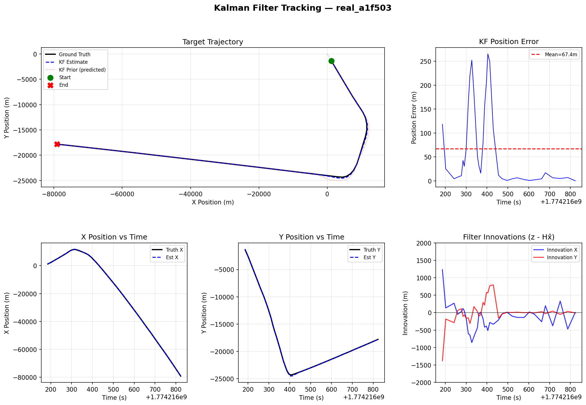
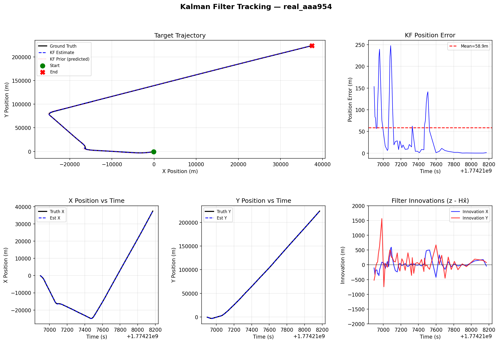

# Multi-Sensor Kalman Filter Target Tracker

A C++17 simulation of multi-sensor data fusion using a discrete-time Kalman Filter for tracking a moving target through noisy sensor measurements. Models radar, IR, and acoustic sensors with configurable noise, detection probability, and dropout events.

Takes real in-flight aircraft pulled from OpenSky ADS-B data from the DFW TRACON sector (matching the airspace_analysis project data) for analysis and positional estimates.

## Project Structure

```
kalman_tracker/
├── CMakeLists.txt
├── README.md
├── requirements.txt
├── include/
│   ├── target.h          # Ground-truth trajectory generation
│   ├── sensor.h          # Sensor models with Gaussian noise
│   ├── kalman_filter.h   # Discrete-time Kalman Filter
│   ├── simulation.h      # Simulation runner + JSON config
│   ├── statistics.h      # RMSE, CSV export, summary printing
│   └── real_track.h      # ADS-B CSV loader + flat-earth projection
├── src/
│   ├── main.cpp          # CLI entry point (--real-track mode added)
│   ├── target.cpp
│   ├── sensor.cpp
│   ├── kalman_filter.cpp
│   ├── simulation.cpp
│   ├── statistics.cpp
│   └── real_track.cpp    # OpenSky track parsing + lat/lon projection
├── tests/
│   ├── test_kalman_filter.cpp
│   ├── test_sensor.cpp
│   └── test_statistics.cpp
├── config/
│   ├── linear_3sensor.json      # Default 3-sensor linear scenario
│   └── evasive_degraded.json    # Evasive target, degraded sensors
├── scripts/
│   ├── plot_results.py          # Python visualization script
│   └── fetch_opensky_track.py   # Fetch real ADS-B tracks from OpenSky
├── data/
│   ├── track_*.csv              # Raw ADS-B tracks (git-ignored)
│   └── output_*.csv             # Filter output CSVs (git-ignored)
└── example_plots/
    ├── a1f503_approach.png     # Example Landing approach validation plot - real data
    └── aaa954_departure.png    # Example Departure procedure validation plot - real data
```

## Dependencies

| Library | Purpose | Install |
|---|---|---|
| [Eigen3](https://eigen.tuxfamily.org) | Matrix math (KF equations) | `sudo apt install libeigen3-dev` |
| [nlohmann/json](https://github.com/nlohmann/json) | JSON config parsing | Auto-fetched by CMake |
| [GoogleTest](https://github.com/google/googletest) | Unit testing | Auto-fetched by CMake |

## Build

```bash
# Install Eigen
sudo pacman -S eigen                  # Arch - originally developed on OMARCHY
sudo apt install libeigen3-dev        # Ubuntu/Debian
brew install eigen                    # macOS

# Configure & build
mkdir build && cd build
cmake .. -DCMAKE_BUILD_TYPE=Release
make -j$(nproc)                       # --> Important to rebuild after changes
```

# OPTIONAL DEFAULT DATA IMPLEMENTATION...
## Run with default data for easy project visualization

```bash
# Use Default Scenario
./kalman_tracker

# From a pre-made config file
./kalman_tracker ../config/linear_3sensor.json

# With custom CSV output path
./kalman_tracker ../config/evasive_degraded.json ../data/evasive_out.csv
```

## Test -- Optional with ADS-B data

```bash
cd build
ctest --output-on-failure
# or run directly:
./tracker_tests
```

## Visualize

```bash
pip install matplotlib
python3 scripts/plot_results.py data/output_linear_3sensor.csv
```


## Run with real-world ADS-B data from OpenSky over the DFW TRACON sector
### - bounding box may be changed to any tracon sector -

```bash
# Discover live icao24 codes
python3 scripts/fetch_opensky_track.py --discover

# Pick icao code from list provided and run
python3 scripts/fetch_opensky_track.py --icao <icao24>

# Example:
python3 scripts/fetch_opensky_track.py -icao abc123

# Use tracker and process noise accordingly
./build/kalman_tracker --real-track data/output_real_<icao24>.csv

# Example with noise processing
./build/kalman_tracker --real-track data/output_real_abc123.csv --process-noise 3.1

# Noise processing can be used with --process-noise (1.0-5.0) or --adsb-noise(100)
- adsb noise is measured in meters --> use 30-75 on unknown aircraft for best results.
```
## Then Visualize
```bash
python3 scripts/plot_results.py data/output_real_abc123.csv
```


Generates a 5-panel plot:
- **XY Trajectory** — ground truth vs KF estimate vs KF prior
- **Position Error** — error over time with mean line
- **X/Y Position** — per-axis comparison
- **Innovations** — filter residuals (z - Hx̂), sanity-checks filter health

## Test Scenarios - NOT using ADS-B data

### `linear_3sensor.json`
Three sensors (Radar, IR, Acoustic) tracking a linearly moving target. Good baseline to verify KF convergence.

### `evasive_degraded.json`
Two degraded sensors tracking an evasively maneuvering target. Tests filter robustness with higher process noise.

### Create Your Own
Edit any `.json` config or create a new one:

```json
{
    "scenario_name": "my_scenario",
    "duration_s": 120.0,
    "dt_s": 0.5,
    "process_noise_std": 1.0,
    "motion_model": "curved",        // "linear" | "curved" | "evasive"
    "sensors": [
        {
            "id": "MySensor",
            "pos_std_x": 20.0,
            "pos_std_y": 20.0,
            "detection_prob": 0.90,
            "dropout_prob": 0.05
        }
    ]
}
```

## Key Metrics (printed at runtime)

| Metric | Description |
|---|---|
| **RMSE Position** | Root Mean Square Error in position (meters) |
| **RMSE Velocity** | Root Mean Square Error in velocity (m/s) |
| **Peak Error** | Worst-case position error across entire track |
| **Mean Innovation** | Average filter residual — near 0 means filter is unbiased |

## Concepts Demonstrated

- **Kalman Filter** — predict/update cycle, state transition matrix (F), process noise (Q), measurement noise (R), Kalman gain (K)
- **Sensor Fusion** — weighted averaging of multi-sensor measurements
- **Gaussian Noise Modeling** — per-sensor noise covariance
- **Motion Models** — constant-velocity, constant-turn-rate, sinusoidal evasion
- **Statistical Analysis** — RMSE, innovation analysis, peak error
- **OOP Design** — clean separation of target, sensor, filter, and simulation concerns
- **Unit Testing** — Google Test coverage for all core components

## ADS-B Validation Results

### Landing Approach (a1f503)

Aircraft coming in on a standard landing approach - likely inbound for final approach at DFW Runway 31L. X position shows steady west flight after t = 300s and Y position shows sharp south flight followed by turn to final heading at t = 400s. Innovations reach low oscillation and Position Error decreases at around t = 500s - presumably as aircraft is on final approach for 31L.

### Standard Instrument Departure Procedure (aaa954)

Aircraft follows a SID out of DFW with assigned heading established at Time t = ~7500s. Y position shows stable climb on the heading after the turn. KF Position error drops shortly after aircraft is established on its outbound heading - similarly showing a decrease in Filter Innovation oscillations.
